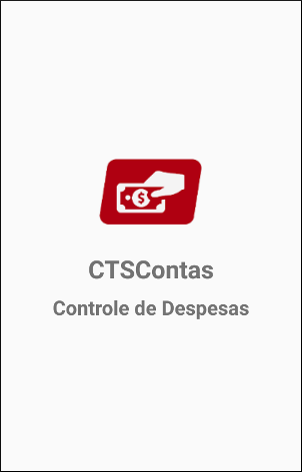
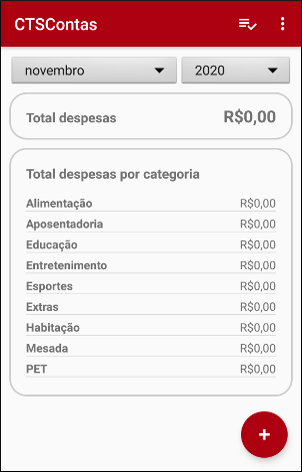
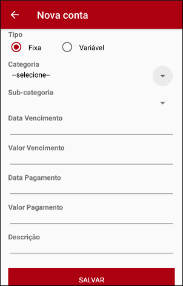
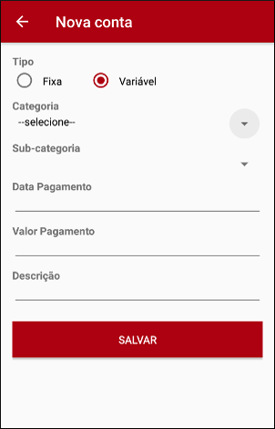
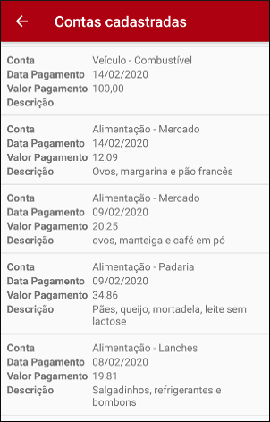
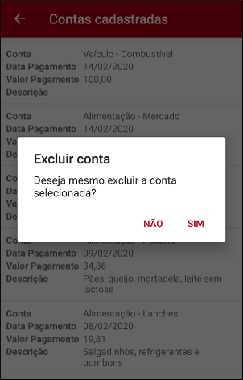
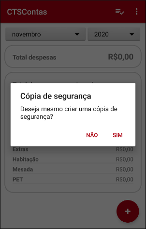
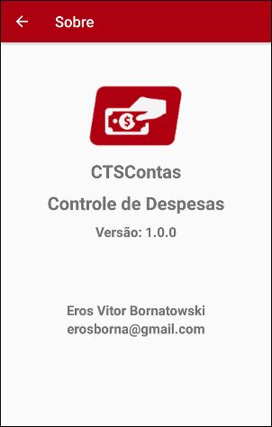

# CTSContas

## Descrição
Aplicativo Android para controle de despesas pessoais. É possível cadastrar despesas fixas e variáveis, listar as despesas já cadastradas, alterar e excluir uma despesa e criar uma cópia de segurança dos dados.

## Screenshots

  

  

  

 

## Histórico de lançamentos

* 1.0.0 (2021-04-28)
    * Primeira versão
